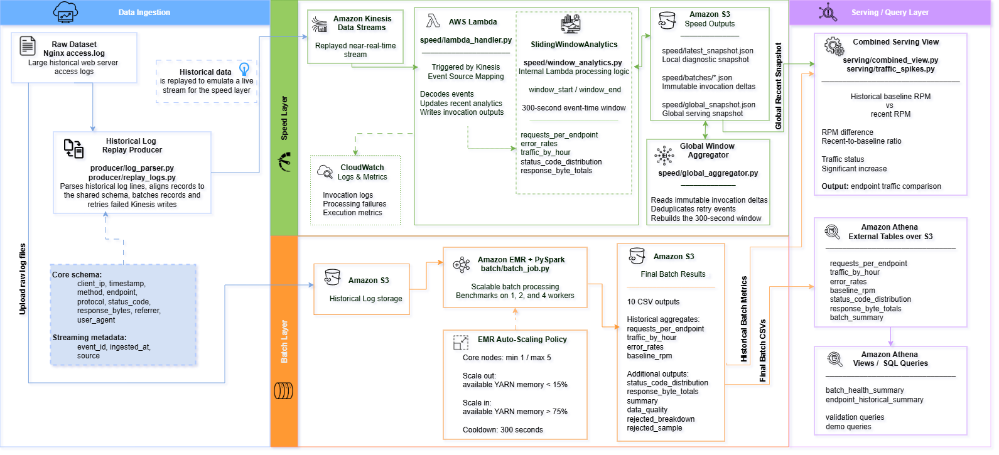

# Scalable Web Log Analytics

A Lambda Architecture project for scalable historical and near-real-time analysis of large Nginx access logs using Python, PySpark, Amazon EMR, Amazon Kinesis Data Streams, AWS Lambda, Amazon S3 and Amazon Athena.

The system combines a complete historical batch path with a recent event-time speed path. A serving layer then compares recent endpoint traffic with a historical requests-per-minute baseline and classifies significant traffic increases.

## Project Status

The technical implementation is complete on the `main` branch.

| Area | Status |
|---|---|
| Shared event schema | Complete |
| PySpark batch layer | Complete |
| Amazon EMR execution and benchmarks | Complete |
| Kinesis and Lambda speed layer | Complete |
| Global speed aggregation | Complete |
| Athena tables, views and reconciliation | Complete |
| Batch-speed serving validation | Complete |
| Automated tests | 64 passed |
| Architecture and evidence | Complete |

Detailed milestones, execution identifiers and remaining submission tasks are recorded in [`STATUS.md`](STATUS.md).

## Architecture



### Historical path

```text
Nginx access logs
        ->
Amazon S3 raw-data storage
        ->
PySpark on Amazon EMR
        ->
Historical aggregates and data-quality outputs in Amazon S3
        ->
Amazon Athena external tables and views
```

### Recent path

```text
Nginx log replay
        ->
Amazon Kinesis Data Streams
        ->
AWS Lambda speed processors
        ->
Latest diagnostic snapshot and immutable invocation deltas in Amazon S3
        ->
Global event-time window aggregator
        ->
Global speed-layer snapshot
```

### Serving path

```text
Historical endpoint metrics from the batch layer
        +
Recent endpoint metrics from the global speed snapshot
        ->
RPM comparison, error-rate analysis and traffic-spike classification
```

The batch path prioritises complete historical correctness. The speed path provides recent analytics. The serving path combines both views without treating one Lambda execution environment as globally complete.

## Main Capabilities

- Shared Nginx event schema across batch and streaming paths.
- Progressive parsing of large raw log files.
- PySpark historical processing on Amazon EMR.
- Data-quality counts and rejection-reason reporting.
- Kinesis `PutRecords` batching with partial-failure retries.
- Event-time sliding-window analytics.
- Error-rate anomaly detection.
- Immutable per-invocation Lambda delta documents in Amazon S3.
- Global reconstruction across concurrent Lambda environments.
- Duplicate-event removal and invalid-document accounting.
- Historical versus recent endpoint RPM comparison.
- Configurable traffic-spike rules.
- Athena external tables, views, validation queries and demo queries.
- Local, integration and AWS-oriented automated tests.
- Retained and sanitised public evidence for the final experiments.

## Key Results

### Final dataset and batch execution

| Metric | Result |
|---|---:|
| Dataset size | 3,502,440,823 bytes |
| Raw log lines | 10,365,152 |
| Valid records | 10,365,077 |
| Rejected records | 75 |
| Invalid format records | 0 |
| Invalid timestamp records | 0 |
| Invalid request records | 75 |
| Endpoint aggregate rows | 893,048 |
| Error responses | 177,634 |
| Response bytes | 128,870,996,472 |
| Final CSV outputs | 10 |

All ten final CSV outputs came from the same validated EMR execution.

### EMR worker benchmark

| Workers | Execution time | Speedup | Efficiency |
|---:|---:|---:|---:|
| 1 | 410.4 s | 1.00x | 100% |
| 2 | 380.1 s | 1.08x | 54% |
| 4 | 294.1 s | 1.40x | 35% |

The four-worker run was the fastest, but scaling was sub-linear because Spark startup, scheduling, communication, shuffle and final-output serialisation overheads remained significant.

### Speed-layer load validation

| Requested events | Successfully sent | Failed | Latest local snapshot | Global endpoint count |
|---:|---:|---:|---:|---:|
| 100 | 100 | 0 | 100 | 100 |
| 500 | 500 | 0 | 500 | 500 |
| 1,000 | 1,000 | 0 | 600 | 1,000 |

The 1,000-event run demonstrates the distributed-state limitation of a per-environment Lambda snapshot. Immutable deltas allowed the global aggregator to recover all 1,000 benchmark events.

### Real batch-speed serving validation

Validation endpoint: `/settings/logo`

| Metric | Result |
|---|---:|
| Historical dataset records | 10,365,077 |
| Historical endpoint requests | 352,047 |
| Historical baseline RPM | 52.255752 |
| Recent events sent to Kinesis | 600 |
| Failed events | 0 |
| Global-window events | 600 |
| Recent RPM | 120.0 |
| RPM difference | 67.744248 |
| Recent-to-baseline ratio | 2.296398 |
| Traffic classification | Significant increase |
| Recent error count | 30 |
| Recent error rate | 0.05 |
| Duplicate events | 0 |
| Invalid documents | 0 |
| Invalid events | 0 |

The recent request rate was approximately 2.30 times the historical baseline and exceeded the minimum recent-request threshold. The separate error-rate anomaly rule was not triggered because `0.05` was below the configured threshold of `0.50`.

## Shared Event Schema

Both processing paths use the following base fields:

```text
client_ip
timestamp
method
endpoint
protocol
status_code
response_bytes
referrer
user_agent
```

The Kinesis path additionally includes:

```text
event_id
ingested_at
source
```

Schema rules:

- `endpoint` is the official request-path field.
- `client_ip` replaces the earlier batch field `ip`.
- `response_bytes` replaces the earlier batch field `bytes_sent`.
- Timestamps are normalised to timezone-aware ISO 8601 UTC values.
- `status_code` and `response_bytes` are integers.
- A response-byte value of `-` is converted to zero.
- HTTP requests must contain a method, endpoint and protocol.
- `event_id` is generated as a unique identifier.
- `source` is set to `nginx_access_log`.

## Repository Structure

```text
athena/       Athena DDL, views, validation and demonstration queries
batch/        PySpark historical processing
benchmark/    Batch, Kinesis and Lambda/S3 benchmark scripts
data/         Local data placeholders and controlled inputs
deployment/   Lambda packaging helpers
docs/         Architecture, evidence and project documentation
infra/        EMR configuration and infrastructure scripts
producer/     Nginx parsing and Kinesis replay utilities
results/      Machine-readable benchmark and integration outputs
serving/      Batch-speed comparison and traffic-spike logic
speed/        Sliding window, Lambda handler, S3 deltas and global aggregation
tests/        Unit and integration tests
```

## Requirements

- Python 3.11
- Java 17
- Apache Spark 3.5.0 through `pyspark==3.5.0`
- AWS CLI for AWS executions
- Valid AWS credentials for Kinesis, Lambda, S3, EMR and Athena operations

The project was evaluated in AWS Academy Learner Lab in `us-east-1`.

## Local Setup

### Windows PowerShell

```powershell
python -m venv .venv
.\.venv\Scripts\Activate.ps1
python -m pip install --upgrade pip
pip install -r requirements.txt
```

### Run the complete test suite

```powershell
python -m unittest discover -s tests -v
```

Latest verified result:

```text
Ran 64 tests in 24.606s

OK
```

Local Spark on Windows may print warnings relating to `winutils.exe`, `HADOOP_HOME`, native Hadoop libraries, socket cleanup or temporary-directory deletion. These warnings do not invalidate a run whose unittest summary ends with `OK` and whose process exit code is `0`.

### Run the controlled batch-stream comparison

```powershell
python -m serving.compare_controlled_window
```

Expected final result:

```text
ALL COMPARABLE METRICS MATCH
```

The generated machine-readable evidence is stored in:

```text
results/integration/batch_stream_comparison.json
```

## Batch Layer

The batch job reads raw Nginx combined-log records, applies the shared validation rules and generates ten output groups:

```text
requests_per_endpoint/
traffic_by_hour/
error_rates/
baseline_rpm/
data_quality/
status_code_distribution/
response_byte_totals/
summary/
rejected_breakdown/
rejected_sample/
```

Example Spark submission:

```bash
spark-submit batch/batch_job.py \
  --input s3://<input-bucket>/raw-data/ \
  --output s3://<output-bucket>/batch-results/
```

The infrastructure template is located at:

```text
infra/emr_setup.sh
```

Review all bucket, subnet, key-pair and instance values before running it.

### Historical baseline definition

The endpoint baseline represents the mean request count across active minute buckets for that endpoint. Minutes in which the endpoint received no requests are not materialised in the grouped Spark result.

### Final-write decision

The batch outputs use `coalesce(1)` to create one CSV part file per output. This simplified evidence collection, delivery reconciliation and Athena registration for the assessed experiment. It also introduced a serial final-write bottleneck. A production design would retain partitioned output.

## EMR Automatic-Scaling Evaluation

The core instance group was configured with:

- minimum capacity: 1;
- initial capacity: 2;
- maximum capacity: 5;
- scale-out threshold: YARN memory available below 15%;
- scale-in threshold: YARN memory available above 75%;
- cooldown: 300 seconds.

The final retry corrected the earlier Step-concurrency configuration:

- Step Concurrency Level was confirmed as 4.
- Four EMR Steps started at approximately the same time.
- Pending containers reached 28.
- The complete unfiltered post-test inventory contained two core instances and one master instance.
- No additional core instance was present.
- No verified scale-out occurred.

The result is reported as a verified policy configuration and genuine concurrent trigger attempt, not as demonstrated elastic scale-out.

Batch and EMR evidence is indexed in:

```text
docs/evidence/batch/README.md
```

## Producer and Kinesis Replay

The producer path:

1. reads the log progressively;
2. parses each line using the shared Nginx parser;
3. skips and counts malformed lines;
4. adds `event_id`, `ingested_at` and `source`;
5. uses `client_ip` as the Kinesis partition key;
6. sends up to 500 records in each `PutRecords` request;
7. retries only failed records;
8. reports successful and permanently failed records.

The reusable implementation is located in:

```text
producer/log_parser.py
producer/replay_logs.py
```

## Speed Layer

The speed layer calculates recent:

- requests per endpoint;
- traffic by hour;
- error rates per endpoint;
- HTTP status-code distribution;
- response-byte totals per endpoint;
- complete response-byte totals;
- window boundaries and event counts.

The Lambda deployment package can be built with:

```powershell
python deployment/build_speed_lambda_package.py
```

The Lambda writes:

```text
speed/latest_snapshot.json
speed/batches/<immutable-delta-documents>.json
```

`latest_snapshot.json` is a diagnostic snapshot from the most recent Lambda execution environment. It is not treated as globally complete under concurrency.

## Global Speed Aggregation

Rebuild the global event-time window from immutable Lambda deltas:

```powershell
python -m speed.global_aggregator `
  --bucket <results-bucket> `
  --prefix speed/batches `
  --output-key speed/global_snapshot.json `
  --window-seconds 300
```

The aggregator:

- lists the persisted delta documents;
- validates each document;
- removes duplicate events;
- rejects invalid events without stopping the run;
- applies the configured event-time window;
- recalculates the speed-layer metrics;
- detects recent error-rate anomalies;
- writes one consolidated global snapshot.

## Serving Layer

Recent RPM is calculated as:

```text
recent_rpm = recent_requests * 60 / window_seconds
```

For each endpoint, the serving view exposes:

- historical requests and errors;
- historical error rate;
- historical response bytes;
- historical baseline RPM;
- recent request count;
- recent RPM;
- RPM difference;
- recent-to-baseline ratio;
- traffic status;
- significant-increase indicator.

The default traffic-spike rule requires:

- a recent-to-baseline ratio of at least `2.0`; and
- at least `10` recent requests.

Traffic-spike classification is separate from the error-rate anomaly rule.

Supporting final serving outputs are stored in:

```text
results/serving/real_batch_metrics.json
results/serving/real_global_aggregation_run.json
results/serving/real_global_snapshot.json
results/serving/real_combined_serving_view.json
docs/evidence/serving/01_real_batch_speed_validation.txt
```

## Amazon Athena

Athena scripts are stored in `athena/` and should be executed in this order:

```text
01_create_database.sql
02_create_external_tables.sql
03_create_views.sql
04_validation_queries.sql
05_demo_queries.sql
```

The deployed analytical layer contains:

- 1 database;
- 7 external tables;
- 2 views;
- reconciliation queries;
- demonstration queries for endpoints, errors and RPM comparison.

Final Athena validation confirmed:

- 893,048 endpoint rows;
- 10,365,077 requests across each main aggregate;
- 128,870,996,472 response bytes;
- 177,634 error responses;
- 15 HTTP status-code categories;
- no empty baseline endpoints;
- no null baseline RPM values.

Athena screenshots are stored in:

```text
docs/evidence/athena/screenshots/
```

## Evidence

Evidence is organised by processing layer:

```text
docs/evidence/batch/
docs/evidence/integration/
docs/evidence/speed/
docs/evidence/serving/
docs/evidence/athena/
docs/evidence/tests/
```

Public AWS screenshots and JSON evidence have been sanitised where necessary. The complete unedited originals are retained in the private project evidence archive.

Important evidence indexes:

- [`docs/evidence/batch/README.md`](docs/evidence/batch/README.md)
- [`docs/evidence/athena/screenshots/README.md`](docs/evidence/athena/screenshots/README.md)
- [`STATUS.md`](STATUS.md)

## Current Limitations

- AWS Academy Learner Lab sessions can expire and terminate temporary resources.
- No completed EMR scale-out was verified during the retained automatic-scaling experiment.
- The historical endpoint baseline is calculated from active minute buckets rather than materialising zero-request minutes.
- `coalesce(1)` creates a serial final-write stage in the batch path.
- A per-environment Lambda snapshot is not globally complete under concurrency.
- The global aggregator currently rereads persisted delta documents and runs explicitly rather than through a scheduled incremental workflow.
- The event-time window advances when a newer event arrives. During complete source idleness, older events remain until another event is processed or the window is rebuilt.
- The controlled benchmarks demonstrate behaviour in the evaluated AWS Academy environment, not a production service-level agreement.

## Production Improvements

A production implementation should:

- write partitioned batch outputs instead of using `coalesce(1)`;
- materialise a clearly defined full-time baseline when zero-request minutes must be included;
- trigger global aggregation through an incremental scheduled or event-driven workflow;
- maintain checkpoints so only new delta documents are processed;
- apply S3 lifecycle rules to old immutable deltas;
- use source-idleness handling or a periodic processing-time trigger for window eviction;
- repeat automatic-scaling tests in an unrestricted AWS account;
- add continuous integration after validating the Spark and Java environment.

## Team Contributions

### Maryhelen

- Shared schema and repository integration
- Nginx parser and reliable Kinesis replay
- Sliding-window speed analytics
- Kinesis-triggered Lambda processing
- S3 snapshot and immutable-delta persistence
- Global speed-layer aggregation
- Combined serving view and traffic-spike comparison
- Athena deployment, reconciliation and evidence
- Final architecture, integration evidence and documentation

### Nalini

- PySpark batch-processing implementation
- Amazon EMR execution and worker benchmarks
- EMR automatic-scaling configuration and evidence
- Final batch outputs and data-quality evidence
- Batch benchmark documentation

## Dataset

The project uses the Kaggle **Web Server Access Logs** dataset, containing raw Nginx-style access-log records. The complete dataset is not committed to Git because of its size.

Small controlled fixtures required by the tests are stored under:

```text
tests/fixtures/
```

## Academic Context

This repository was developed for the Scalable Cloud Programming continuous assessment in the MSc in Cloud Computing programme at the National College of Ireland.

The repository is an academic prototype. It should not be treated as a production monitoring service without the improvements described above.
